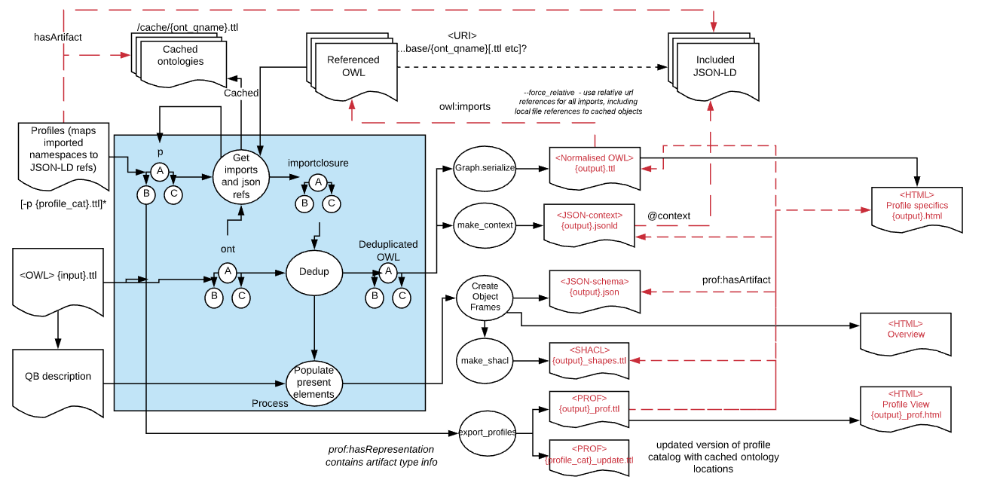

# ProfileWiz

A tool to support round-tripping between modular and flattened versions of profiles of data models expressed using OWL, JSON-Schema, SHACL etc.

Generates HTML for Ontology and Profile views using pyLODE

ProfileWiz uses the [W3C Profiles Vocabulary](https://www.w3.org/TR/dx-prof/) to both accept configuration and output documentation of locations of various different views of data model profiles used and generated by different operating modes.

Profiles document the way external ontologies are used in specific circumstances. Please read the section on "Namespaces and Ontology identification"

## Status
In development, focussed on Use Case 1.


## Use Cases
1. **Flattened => Modular**  
Take a data model (such as an OWL ontology) containing copied (and potentially modified) versions of definitions from "standard" models, intended to document a profile of those external models, and build a better Modular version that contains clear expression of the intended constraints on the original model, and create implementation resources such as JSON-LD contexts with imports of reusable, cachable modules.
2. **Modular Model => Flattened**  
Take a modular profile hierarchy and create "flattened" versions with no requirement for imports
3. **Profile validity**  
Consistency checking of profiles with respect to their base specifications - do they break any of the specs' rules?
4. **Implementation => Models**  
Extract data models from implementation resources - such as JSON-schema and JSON-LD context documents.
5. **Change detection** if imported (profiled) models change detect differences and provide views and automated processes to support review and update of model definitions.

## In pictures.. Use Case 1 - Modular outputs


## Installation
Clone this repository.

run python profilewiz --help

or to install as a editable module

pip install -e <workingcopy>

TODO: replace with package install once stable


## Usage

typical usage with a local library of ontologies, run from a separate directory at the same level as a directory with models to profile:
```
python.exe /repos/misc/profilewiz/profilewiz/profilewiz.py -n --all -x -p=lib/profile_cat.ttl ../models/*.ttl
```

```
usage: profilewiz.py [-h] [-o [OUTPUT]] [-q] [-c] [-ho] [-hp] [-r]
                     [-p P [P ...]] [-a] [-i [INIT_LIB]]
                     input

Create JSON context, schema and other views of an ontology

positional arguments:
  input                 input file containing ontology in TTL format

optional arguments:
  -h, --help            show this help message and exit
  -o [OUTPUT], --output [OUTPUT]
                        output file
  -q, --qnames_only     use qnames only for JSON elements
  -c, --choose-class    Choose a main Class object to create structural
                        schema. Properties defined but not used are assumed to
                        be allowable properties of main Class
  -ho, --html_owl       If set generate HTML for output OWL file, if present
                        then do not perform analysis functions.
  -hp, --html_prof      If set generate HTML for output Profile description,
                        if present then do not perform analysis functions.
  -r, --force_relative  use relative filenames and cached copies for imports
  -p P [P ...], --profiles P [P ...]
                        file name or URL of profiles model with pre-configured
                        resource locations
  -a, --ask             Ask for filenames and URI locations for imports not
                        present in lib or cache
  -i [INIT_LIB], --init_lib [INIT_LIB]
                        Initialise or update profile library and profile
                        catalog with used namespaces using first named profile
                        catalog
```

## Namespaces and Ontology identification

  
There is a loose coupling between a range of related concepts:

1. Namespaces - these may be defined by prefixes in some syntax - and are the root (or base) of URIs.
2. Ontologies - these are declared using statements of the form
"URI a owl:Ontology"
3. Graphs - these are any grouping of statements in a context
4. Files - these are any groupings of content in a resource such as a file or response from resolving a URI

Namespaces are typically similar to Ontology URI, with the addition of a joiner ("/" or "#"), although some Ontologies may have URIs already ending in such joiners.
Ideally both Namespace and Ontology URIs resolve to the same definitive OWL artefact.

Typical assumptions used by ProfileWiz, reflecting the unwritten rules (an assumed Best Pactice) for ontology publishing:

* a 1:1 relationship amongst these concepts where
* Namespaces can be mapped to Files which should contain exactly one object of type Ontology. 
* Ontology objects are the identifier for statements about relationships
* Namespaces and Ontology URIs do not reliably resolve to accessible Files
* Files may be cached locally for performance
* For Ontologies it is assumed Files contain a single Graph which (directly or through transitive owl:imports) contain definitions for all objects in the Ontology
* A Ontology may define a 'import closure' via owl:imports to explicitly reference definitions. This may or may not indicate profiling relationship, however presence of additional statements about objects defined in the import closure does imply profiling intention.

So the challenge is to map objects discovered in a profile to the underlying Ontology that defines it. This is done in the following order:

1. Presence of object's namespace in a **profile catalog** - containing, per Ontology:

	* Ontology ID
	* Namespace to map to this Ontology
	* Location of local cached File (if available)
	* Location of download URL
	* Parent profile
+ Presence of object's namespace (with or without joiner) as the URI of an Ontology object in the import closure
+ Resolution of the object's namespace as a URI to retrieve a File, and presence of an owl:Ontology declaration in the Graph contained in the File
+ Resolution of the object's namespace, trimmed to remove joiner, as a URI to retrieve a File, and presence of an owl:Ontology declaration in the Graph contained in the File.
+ Presence of the object in the "import closure" of the ontology being processed, and the Ontology object of the Graph that contains the definition.

To simplify processing and document assumptions, ProfileWiz provides an interactive mode to build a **profile catalog** and declare intended profiling relationships, which is used as the definitive solution and part of provenance documentation for profile processing. 


## License
This tool and its code are licensed using the [Creative Commons CC-BY 4.0](https://creativecommons.org/licenses/by/4.0/) license. See the [LICENSE file in this repo](LICENSE) for the deed.

## Acknowledgements

This software has been supported through  the participation of the OpenGeospatial Consortium in the European Union’s Horizon 2020 research and innovation programme projects CYBELE (Grant Agreement No 825355) and DEMETER (Grant Agreement No 857202)

## Contributing
This project encourages contributions and collaboration! Please create Issues for the code or, better, Pull Requests to enhance function. Contributions will be recognised in release notes and other documetation.

For more information on contributing, please contact us via the *Contact* details below.

## Contacts

Please submit issues if required.


Author:
Rob Atkinson
Senior Research Engineer
Open Geospatial Consortium
ratkinson - "at" - ogc.org
